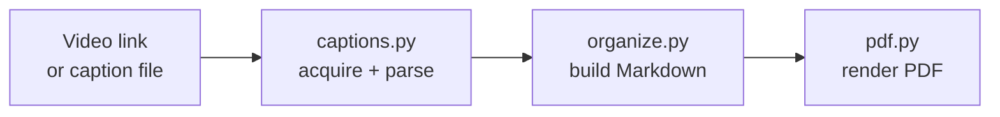

# video-captions-to-doc

Turn a video link into an informational reference paper: pull the captions, rewrite
them as impersonal documentation organized by **topic**, highlight the key terms,
illustrate the ideas with **diagrams**, and write both a Markdown file and a matching
PDF named after the video.

**No AI required.** Extraction is yt-dlp, and the document - overview, summary, topic
sections, key terms, diagrams - is built by plain Python. Claude is an opt-in flag, not
a dependency: take the Markdown and run your own analysis on it however you like.

```
captions2doc "https://www.youtube.com/watch?v=..."
```

## Install

```bash
python3 -m venv .venv
source .venv/bin/activate             # Windows: .venv\Scripts\activate
pip install -e .
```

That puts the `captions2doc` command on your `PATH`:

```bash
captions2doc --help
```

The command lives in `.venv/bin/`, so it is only on `PATH` while the virtualenv is
active. Open a new terminal and you need `source .venv/bin/activate` again - or skip
activation and call it by path, which always works:

```bash
./.venv/bin/captions2doc --help       # Windows: .venv\Scripts\captions2doc --help
./.venv/bin/python -m video_captions  # equivalent, no entry point needed
```

To install it once and have it available everywhere, without a virtualenv to activate:

```bash
pipx install -e .
```

All examples below assume an activated virtualenv.

Runs on macOS, Linux and Windows - Python 3.10+ and pip are the only requirements.
The optional extras need one external binary each: **ffmpeg** for transcription
(`brew install ffmpeg`, `apt install ffmpeg`, or `winget install ffmpeg`), and
**mermaid-cli** only if you want it to override the built-in diagram renderer.

For videos that publish no captions, add local speech-to-text (large download, needed
only for that case):

```bash
pip install -e '.[transcribe]'
```

### Optional: rewriting with Claude

`--claude` replaces the built-in organizer with a Claude rewrite. It needs an API key
and is billed per use - the built-in path is the default and needs neither.

```bash
export ANTHROPIC_API_KEY=sk-ant-...   # from console.anthropic.com
captions2doc --claude "https://youtu.be/..."
```

The difference is extractive vs abstractive: offline you get real sentences selected
and cleaned from the transcript; with Claude the content is condensed and rewritten as
prose. If the key is missing or rejected, the app prints a notice and falls back to the
built-in organizer rather than failing.

## Getting the captions

1. **Published captions** - yt-dlp fetches them, preferring manual subtitles over
   auto-generated ones.
2. **No captions?** The audio track alone is downloaded and transcribed locally with
   Whisper (`faster-whisper`, or the `openai-whisper` package, or a `whisper` binary -
   whichever is installed). Nothing is sent anywhere; ffmpeg must be on PATH.
3. Either way the captions are saved into `input/` as a `.vtt`, so re-running is free
   and you can edit them by hand before converting.

```bash
captions2doc "https://youtu.be/..."          # captions, or transcription if there are none
captions2doc --transcribe "https://..."      # force transcription (auto-captions are poor)
captions2doc --from-media lecture.mp4        # a local video or audio file
captions2doc --no-transcribe "https://..."   # fail instead of transcribing
```

`--whisper-model` picks the size: `tiny`, `base` (default), `small`, `medium`,
`large-v3`. Bigger is slower and more accurate - `tiny` mishears technical terms
("routes" -> "roots"), `small` and up are noticeably better.

## Folders

```
input/   caption sources (*.vtt, *.srt) - downloaded captions are saved here too
output/  generated documents (*.md, *.pdf, optional *.transcript.txt)
```

Both default to `./input` and `./output` relative to wherever you run the command, and
both can be pointed elsewhere with `--indir` / `--outdir`.

## Usage

```bash
# Convert every .vtt / .srt sitting in ./input
captions2doc

# From a URL (anything yt-dlp supports: YouTube, Vimeo, ...)
# the caption file lands in input/, the documents in output/
captions2doc "https://www.youtube.com/watch?v=UV6TFPDCMOY"

# One specific caption file (a bare name is looked up inside input/)
captions2doc --from-vtt "captions.en.vtt"
```

| Flag | Meaning |
|---|---|
| `-i, --indir DIR` | Folder holding caption files (default: `./input`) |
| `-o, --outdir DIR` | Folder for generated documents (default: `./output`) |
| `-l, --lang CODE` | Caption language to prefer (default: `en`) |
| `--title TEXT` | Override the title used for headings and filenames |
| `--url LINK` | Video link to reference when converting a local caption file |
| `--model ID` | Claude model, with `--claude` (default: `claude-opus-5`) |
| `--claude` | Rewrite with Claude instead of the built-in organizer (needs an API key) |
| `--transcribe` | Transcribe the audio locally even if captions exist |
| `--no-transcribe` | Fail instead of transcribing when a video has no captions |
| `--whisper-model` | Speech-to-text model size (default: `base`) |
| `--from-media FILE` | Local audio/video file to transcribe, then convert |
| `-s, --summary` | Write a short briefing note instead of the full paper |
| `--no-diagrams` | Do not generate diagrams |
| `--no-pdf` | Write only the Markdown file |
| `--no-keep-vtt` | Do not save downloaded captions into `input/` |
| `--save-transcript` | Also write the raw de-duplicated transcript as `.txt` |

## Summaries

Every document already carries two condensed layers - a prose `## Overview` and a
bulleted `## Summary` near the top, plus `## Key Takeaways` at the end.

For a brief on its own, use `-s` / `--summary`: overview, summary bullets and key
terms only - no topic sections, no diagrams. It is written alongside the full paper as
`Title (summary).md` / `.pdf`.

```bash
captions2doc --summary              # brief for everything in ./input
captions2doc -s "https://youtu.be/..."
```

**The summary does not require Claude.** By default it is produced by an *extractive*
summarizer in pure Python: sentences are scored by how much of the
document's own vocabulary they carry, then selected greedily while skipping any
sentence that mostly repeats one already chosen, so the bullets cover different ground.
The result is real sentences lifted from the transcript, cleaned of disfluencies,
stutters and speaker markers.

With Claude the summary is *abstractive* - the content is condensed and rewritten, so
it reads as prose written for the purpose rather than as selected quotes. Both paths
produce the same section structure.

## Reference paper, not a transcript

The document reads as an informational paper about the subject, not a record of
someone talking about it:

- **No first or second person.** No "I", "we", "our", "you" - and no addressing the
  reader.
- **No small talk.** Greetings, introductions, thanks, sign-offs, promotion, "in this
  video", "as we saw earlier", and sentences whose only job is announcing what comes
  next are all removed.
- **Straight to the point.** Declarative present tense, subject stated as fact:
  *"The control plane computes routes"*, not *"Now let's look at how the control plane
  computes routes"*.
- **Key terms highlighted** in bold on first mention so the document can be skimmed,
  plus a `## Key Terms` section at the end. In the PDF, highlighted terms are drawn in
  the accent colour.

By default this is done by `prose.py`, which applies an explicit
rule table - drop conversational sentences, strip discourse markers ("So,", "Now,",
"Basically,"), rewrite safe frames (*"we can add capacity"* -> *"it is possible to add
capacity"*, *"let's say"* -> *"suppose"*, *"think of it like"* -> *"this is analogous
to"*) - and drops anything still carrying a personal pronoun rather than inventing a
paraphrase. With `--claude` the same result comes from rewriting instead.

## Source links

Every document points back at the video it came from:

- a **Source** link under the title,
- a **jump link on each topic** (`[Watch from 4:12](...&t=252s)`) so a section in your
  notes takes you to that moment in the video,
- a **Source** section at the end.

Deep links are generated for YouTube (`&t=252s`) and Vimeo (`#t=252s`); other hosts get
the plain link. When you convert a local caption file, the link is recovered from
yt-dlp's `Title [VIDEOID].en.vtt` filename, or you can supply it with `--url`.

## Diagrams

Claude is asked to add a Mermaid diagram wherever a picture carries the idea better
than prose - an architecture, a flow, a decision, a lifecycle, a topic hierarchy.

In the Markdown these are plain ```` ```mermaid ```` blocks, so GitHub, VS Code,
Obsidian and Claude render them natively. The PDF has no browser available, so
`diagrams.py` parses the diagram and draws it as **native vector graphics** with
ReportLab: layered layout, barycentre-ordered nodes to reduce edge crossings, rectangle
/ rounded / stadium / diamond / circle shapes, solid and dashed edges, and edge labels.

Supported forms: `flowchart TD`, `flowchart LR`, and `mindmap`. If
[mermaid-cli](https://github.com/mermaid-js/mermaid-cli) (`mmdc`) is on `PATH` it is
used instead and every diagram type works. Anything unsupported degrades to its source
text in a code block rather than breaking the document.

## How it works

Three stages - acquire captions, organize into a document, render the PDF -
each with an offline path:



See **[docs/architecture.md](docs/architecture.md)** for the module table, the
caption-acquisition and fallback decision flows, and the cost model.

## Tests

```bash
python -m unittest discover -s tests
```
