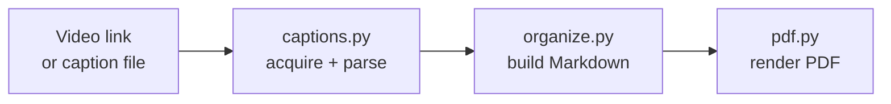

# captions2doc

Turn a video link into an informational reference paper: pull the captions, rewrite
them as impersonal documentation organized by **topic**, highlight the key terms,
illustrate the ideas with **diagrams**, and write both a Markdown file and a matching
PDF named after the video.

**No AI required.** Extraction is yt-dlp, and the document - overview, summary, topic
sections, key terms, diagrams - is built by plain Python. Claude is an opt-in flag, not
a dependency: take the Markdown and run your own analysis on it however you like.

```
captions2doc "https://www.youtube.com/watch?v=..."
```

## Install

Python 3.10+ and pip are the only requirements; the app runs on Windows, macOS and
Linux. Pick your platform below.

Two ways to install:

- **From a released wheel** - download the `.whl` from the [Releases](../../releases)
  page. Nothing to clone. This is the normal way to *use* the app.
- **From source** - clone the repo and install in editable mode. This is the way to
  *work on* it.

Both give you a `captions2doc` command. `pipx` is recommended for the wheel: it puts the
app in its own isolated environment, keeps its dependencies away from your system
Python, and fixes your `PATH` for you.

### Windows

From a released wheel, in PowerShell:

```powershell
py -m pip install --user pipx
py -m pipx ensurepath
py -m pipx install .\captions2doc-1.0.0-py3-none-any.whl
```

Open a **new** terminal after `ensurepath`, then check it:

```powershell
captions2doc --help
```

From source:

```powershell
git clone https://github.com/USER/REPO.git
cd REPO
py -m venv .venv
.venv\Scripts\activate
pip install -e .
```

*If PowerShell says "running scripts is disabled on this system", allow it once with
`Set-ExecutionPolicy -Scope CurrentUser RemoteSigned`, or use `cmd`, where
`.venv\Scripts\activate.bat` runs without that restriction.*

*If `captions2doc` is "not recognized as the name of a cmdlet", your Python `Scripts\`
folder is not on `PATH` - it is only added when **Add python.exe to PATH** was ticked
during Python setup. `py -m pipx ensurepath` fixes it, and `py -m video_captions` works
regardless.*

### macOS

From a released wheel:

```bash
brew install pipx
pipx ensurepath
pipx install ./captions2doc-1.0.0-py3-none-any.whl
```

Open a **new** terminal after `ensurepath`, then check it:

```bash
captions2doc --help
```

From source:

```bash
git clone https://github.com/USER/REPO.git
cd REPO
python3 -m venv .venv
source .venv/bin/activate
pip install -e .
```

*Homebrew's Python is externally managed, so a plain `pip install` outside a virtualenv
is refused. Use pipx or a venv, as above.*

### Ubuntu / Debian

From a released wheel:

```bash
sudo apt install pipx
pipx ensurepath
pipx install ./captions2doc-1.0.0-py3-none-any.whl
```

Open a **new** shell after `ensurepath`, then check it:

```bash
captions2doc --help
```

From source:

```bash
git clone https://github.com/USER/REPO.git
cd REPO
python3 -m venv .venv
source .venv/bin/activate
pip install -e .
```

*On Ubuntu 23.04+ and Debian 12+ the system Python is externally managed, so
`sudo pip install` is refused - that is what pipx and venvs are for.*

*`pip install --user <wheel>` also works, but Ubuntu adds `~/.local/bin` to `PATH` only
if that folder existed at login, so on a first install the command is "not found" until
you log out and back in. `pipx ensurepath` avoids this.*

### Running it without the command on PATH

These always work, on every platform, whatever `PATH` says:

```bash
python3 -m video_captions --help      # Windows: py -m video_captions --help
./.venv/bin/captions2doc --help       # from a source install, without activating
```

A source install's `captions2doc` lives in the virtualenv, so it is on `PATH` only while
that virtualenv is active. Every example below assumes an activated virtualenv, or a
pipx install.

### Optional: local transcription

Only needed for videos that publish no captions. It is a large download, and it needs
**ffmpeg** on `PATH`:

| Platform | ffmpeg |
|---|---|
| Windows | `winget install Gyan.FFmpeg` |
| macOS | `brew install ffmpeg` |
| Ubuntu / Debian | `sudo apt install ffmpeg` |

Then add the extra, matching how you installed the app:

```bash
pip install -e '.[transcribe]'                        # source install
pipx inject captions2doc faster-whisper      # pipx install
```

**mermaid-cli** is optional too, and only if you want it to override the built-in
diagram renderer.

### Optional: rewriting with Claude

`--claude` replaces the built-in organizer with a Claude rewrite. It needs an API key
and is billed per use - the built-in path is the default and needs neither.

```bash
export ANTHROPIC_API_KEY=sk-ant-...   # macOS / Linux, from console.anthropic.com
captions2doc --claude "https://youtu.be/..."
```

```powershell
$env:ANTHROPIC_API_KEY = "sk-ant-..."   # Windows PowerShell, this session only
captions2doc --claude "https://youtu.be/..."
```

The difference is extractive vs abstractive: offline you get real sentences selected
and cleaned from the transcript; with Claude the content is condensed and rewritten as
prose. If the key is missing or rejected, the app prints a notice and falls back to the
built-in organizer rather than failing.

## Getting the captions

1. **Published captions** - yt-dlp fetches them, preferring manual subtitles over
   auto-generated ones.
2. **No captions?** The audio track alone is downloaded and transcribed locally with
   Whisper (`faster-whisper`, or the `openai-whisper` package, or a `whisper` binary -
   whichever is installed). Nothing is sent anywhere; ffmpeg must be on PATH.
3. Either way the captions are saved into `input/` as a `.vtt`, so re-running is free
   and you can edit them by hand before converting.

```bash
captions2doc "https://youtu.be/..."          # captions, or transcription if there are none
captions2doc --transcribe "https://..."      # force transcription (auto-captions are poor)
captions2doc --from-media lecture.mp4        # a local video or audio file
captions2doc --no-transcribe "https://..."   # fail instead of transcribing
```

`--whisper-model` picks the size: `tiny`, `base` (default), `small`, `medium`,
`large-v3`. Bigger is slower and more accurate - `tiny` mishears technical terms
("routes" -> "roots"), `small` and up are noticeably better.

## Folders

```
input/   caption sources (*.vtt, *.srt) - downloaded captions are saved here too
output/  generated documents (*.md, *.pdf, optional *.transcript.txt)
```

Both default to `./input` and `./output` relative to wherever you run the command, and
both can be pointed elsewhere with `--indir` / `--outdir`.

**Filenames carry no spaces.** The video title becomes the stem with `_` as the single
separator — spaces, hyphens already in the title, and characters Windows forbids all
collapse to one underscore, so a generated path never needs quoting:

```
"Control Plane vs Data Plane: The Network Layer Explained"
  -> Control_Plane_vs_Data_Plane_The_Network_Layer_Explained.en.vtt   (input/)
  -> Control_Plane_vs_Data_Plane_The_Network_Layer_Explained.md       (output/)
```

## Usage

```bash
# Convert every .vtt / .srt sitting in ./input
captions2doc

# From a URL (anything yt-dlp supports: YouTube, Vimeo, ...)
# the caption file lands in input/, the documents in output/
captions2doc "https://www.youtube.com/watch?v=UV6TFPDCMOY"

# One specific caption file (a bare name is looked up inside input/)
captions2doc --from-vtt "captions.en.vtt"
```

| Flag | Meaning |
|---|---|
| `-i, --indir DIR` | Folder holding caption files (default: `./input`) |
| `-o, --outdir DIR` | Folder for generated documents (default: `./output`) |
| `-l, --lang CODE` | Caption language to prefer (default: `en`) |
| `--title TEXT` | Override the title used for headings and filenames |
| `--url LINK` | Video link to reference when converting a local caption file |
| `--model ID` | Claude model, with `--claude` (default: `claude-opus-5`) |
| `--claude` | Rewrite with Claude instead of the built-in organizer (needs an API key) |
| `--transcribe` | Transcribe the audio locally even if captions exist |
| `--no-transcribe` | Fail instead of transcribing when a video has no captions |
| `--whisper-model` | Speech-to-text model size (default: `base`) |
| `--from-media FILE` | Local audio/video file to transcribe, then convert |
| `-s, --summary` | Write a short briefing note instead of the full paper |
| `--no-diagrams` | Do not generate diagrams |
| `--no-pdf` | Write only the Markdown file |
| `--no-keep-vtt` | Do not save downloaded captions into `input/` |
| `--save-transcript` | Also write the raw de-duplicated transcript as `.txt` |

## Summaries

Every document already carries two condensed layers - a prose `## Overview` and a
bulleted `## Summary` near the top, plus `## Key Takeaways` at the end.

For a brief on its own, use `-s` / `--summary`: overview, summary bullets and key
terms only - no topic sections, no diagrams. It is written alongside the full paper as
`Title (summary).md` / `.pdf`.

```bash
captions2doc --summary              # brief for everything in ./input
captions2doc -s "https://youtu.be/..."
```

**The summary does not require Claude.** By default it is produced by an *extractive*
summarizer in pure Python: sentences are scored by how much of the
document's own vocabulary they carry, then selected greedily while skipping any
sentence that mostly repeats one already chosen, so the bullets cover different ground.
The result is real sentences lifted from the transcript, cleaned of disfluencies,
stutters and speaker markers.

With Claude the summary is *abstractive* - the content is condensed and rewritten, so
it reads as prose written for the purpose rather than as selected quotes. Both paths
produce the same section structure.

## The generated document

The output is an informational paper, not a transcript: impersonal prose with the small
talk removed, key terms in bold, a source link plus a per-topic jump link back into the
video, and Mermaid diagrams where a picture carries the idea better than prose.

See **[docs/output-format.md](docs/output-format.md)** for the full rules.

## How it works

Three stages - acquire captions, organize into a document, render the PDF -
each with an offline path:



See **[docs/architecture.md](docs/architecture.md)** for the module table, the
caption-acquisition and fallback decision flows, and the cost model.

## Testing it locally

### Set up once

From a clone, in the project folder:

```bash
python3 -m venv .venv
source .venv/bin/activate          # Windows: .venv\Scripts\activate
pip install -e ".[transcribe]"     # drop [transcribe] to skip Whisper
```

`-e` is an **editable** install: `src/` is used directly, so edits take effect with no
reinstall, and both `captions2doc` and `import video_captions` resolve.

> ⚠️ **A virtualenv cannot be moved or renamed.** Its scripts hard-code absolute paths,
> so renaming the project folder leaves `.venv/bin/captions2doc` pointing at a path that
> no longer exists — it fails with **`bad interpreter`**, and `import video_captions`
> fails with **`ModuleNotFoundError`** even though the code is right there. Fix it with
> `pip install -e .` again, or delete `.venv` and rebuild it.

### Run the tests

```bash
python -m unittest discover -s tests      # 44 tests
```

⚠️ Needs the editable install above, or the package is not importable. Without it, use
`PYTHONPATH=src python -m unittest discover -s tests`. There is no `pytest` dependency —
the suite is plain `unittest`.

### Run it on the sample captions

The repo ships caption files in `input/`, so this works with no network:

```bash
captions2doc                              # convert everything in ./input
captions2doc --from-vtt tradewar.en.vtt   # one file; bare names resolve in input/
captions2doc --no-pdf                     # Markdown only - much faster to iterate
```

### Run it on a link

```bash
captions2doc "https://www.youtube.com/watch?v=UV6TFPDCMOY"
```

⚠️ **Quote the URL.** YouTube links contain `?` and `&`, which the shell would otherwise
interpret.

The captions land in `input/`, the documents in `output/`. Re-running the same link is
free — the `.vtt` is already there, so `--from-vtt <name>.en.vtt` skips the download.

### Keep test runs out of your real folders

Point both folders somewhere disposable:

```bash
captions2doc "https://www.youtube.com/watch?v=UV6TFPDCMOY" \
  --indir /tmp/c2d/in --outdir /tmp/c2d/out --no-pdf
```

```
-> Fetching captions for https://www.youtube.com/watch?v=UV6TFPDCMOY
   saved captions to /tmp/c2d/in/Control_Plane_vs_Data_Plane_The_Network_Layer_Explained.en.vtt
   'Control Plane vs Data Plane: The Network Layer Explained' - 376 cues, 2,162 words
-> Organizing into topics
   wrote /tmp/c2d/out/Control_Plane_vs_Data_Plane_The_Network_Layer_Explained.md
```

### Flags worth knowing while testing

| Flag | Why |
|------|-----|
| `--no-pdf` | Markdown only — the fastest loop |
| `-s` | Short briefing note instead of the full topic paper |
| `--title TEXT` | Force the title, and so the filename |
| `--url LINK` | Set the source link by hand for a local caption file |
| `--no-keep-vtt` | Do not save the download into `input/` |
| `--save-transcript` | Also write the raw timestamped transcript |
| `--no-transcribe` | Fail fast instead of falling back to Whisper |
| `--claude` | Rewrite with Claude — ⚠️ needs `ANTHROPIC_API_KEY`, **billed per use** |

💡 A video with no published captions falls back to transcribing the audio locally, which
is slow and needs **ffmpeg** on `PATH`. Use `--no-transcribe` while testing so that case
fails immediately instead of running for minutes.

## Releasing

CI builds the wheel on every push, so packaging breakage shows up before a release.
To publish one, bump `version` in `pyproject.toml`, then tag it:

```bash
git tag v1.0.1 && git push origin v1.0.1
```

The release workflow builds the wheel and sdist, verifies the tag matches the version
in `pyproject.toml`, installs the wheel in a clean venv to check the `captions2doc`
entry point works, and attaches both files to a GitHub Release. Users can then install
without cloning:

```bash
pip install https://github.com/USER/REPO/releases/download/v1.0.1/captions2doc-1.0.1-py3-none-any.whl
```

