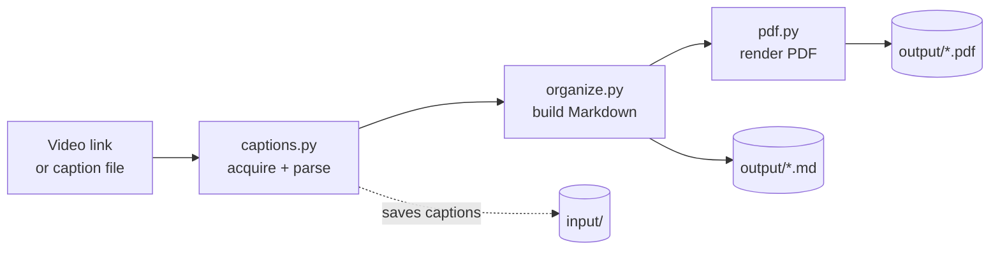
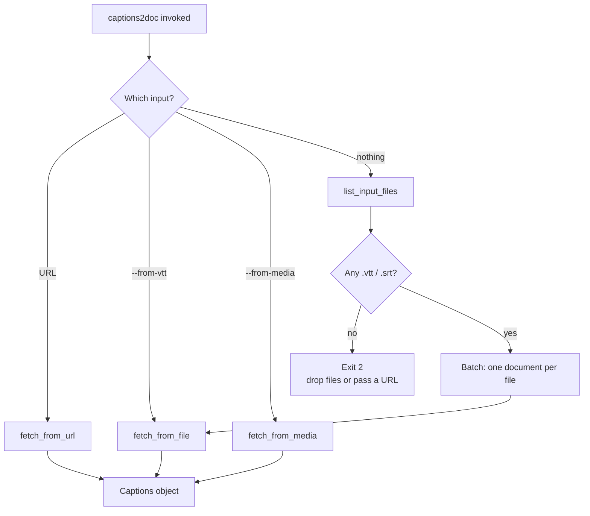
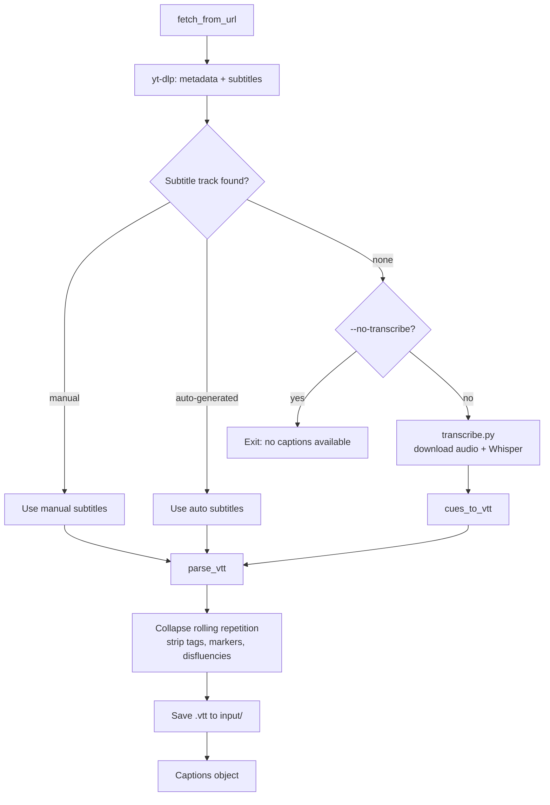
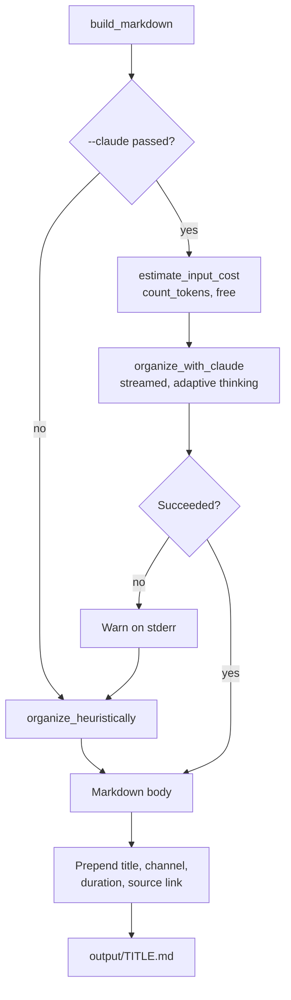
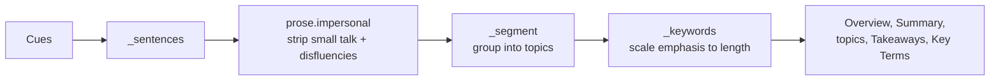
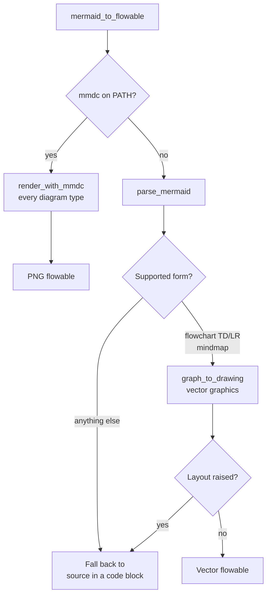

# Architecture

How `captions2doc` turns a video link into a Markdown paper and a PDF.

The pipeline has three stages, and every stage has an offline path. Nothing
leaves the machine unless you pass `--claude`.



## Modules

| Module | Role |
|---|---|
| `cli.py` | Argument parsing, `input/` → `output/` resolution, folder setup, batch mode, filename sanitization. |
| `captions.py` | `yt-dlp` fetches metadata + subtitles (manual preferred, auto-generated as fallback) and keeps a copy in `input/`. Parses WebVTT/SRT, collapses YouTube's rolling-caption repetition into a linear transcript, and builds source / timestamp deep links. |
| `transcribe.py` | Local Whisper speech-to-text for videos with no published captions, and WebVTT serialization of the result. |
| `organize.py` | Builds the document. The offline organizer segments the transcript, labels topics, scores sentences and surfaces examples. With `--claude`, sends the timestamped transcript to Claude instead (`claude-opus-5`, adaptive thinking, streamed) and falls back to the offline path on any API problem. |
| `prose.py` | Rule-based rewriting of spoken sentences into impersonal reference prose: drops small talk, strips disfluencies and stutters, depersonalizes what it can. Backs the offline organizer. |
| `diagrams.py` | Mermaid parser + ReportLab vector renderer, for diagrams in the PDF. |
| `pdf.py` | Renders the Markdown: headings, bullet/numbered lists, pipe tables, fenced code, blockquotes, rules, inline bold/italic/code/links, diagrams, page numbers, running footer. |
| `textutil.py` | Folds fullwidth punctuation, smart quotes and emoji into what the PDF core fonts can actually draw. |

## Stage 1 — where the captions come from

`cli.main` accepts exactly one of a URL, `--from-vtt`, or `--from-media`; with
none of them it converts every caption file in `input/` as a batch.



A batch keeps going when one file fails: the error is reported per file and the
exit code is 1 if any failed.

### Acquiring captions from a URL

Published captions are always preferred over transcription — it is faster, more
accurate, and free. Whisper is the fallback, not the default.



`--transcribe` forces the Whisper path even when captions exist. The saved
`.vtt` is what makes a rerun free, and it can be hand-edited before rerunning.

## Stage 2 — building the document

**The offline organizer is the default.** Claude is opt-in via `--claude`, and
even then a failure degrades to the offline path rather than aborting the run.



### Inside the offline organizer

No model, no network. Sentences are scored by keyword density and de-duplicated
so the bullets cover different ground.



Emphasis is scaled to transcript length — roughly one key term per 250 words,
capped at 12, and none at all under 120 words — so bold stays scarce enough to
mean something.

## Stage 3 — rendering the PDF

Markdown diagrams are plain ` ```mermaid ` blocks, which GitHub, VS Code and
Obsidian render natively. The PDF has no browser, so each diagram walks a
three-step fallback chain and a diagram can never break the document.



The built-in renderer does layered layout with barycentre-ordered nodes to
reduce edge crossings, and supports rectangle / rounded / stadium / diamond /
circle shapes, solid and dashed edges, and edge labels.

## Cost model

One `--claude` run is a **single** request — no per-section calls, no retry
loop. Before it fires, `estimate_input_cost` prints the input token count and
price using the free `count_tokens` endpoint. Output cannot be priced ahead of
generation and is the larger share of the bill, so the estimate says so rather
than implying it is the total.

Everything else — yt-dlp, Whisper, the offline organizer, Mermaid parsing, PDF
rendering — is local compute and costs nothing.

## Folder handling

`input/` is created eagerly at startup; `output/` is created lazily, only once a
document is about to be written, so an aborted run leaves no empty folder
behind. Both go through `ensure_dir`, which reports a path conflict in words
rather than leaking an errno.
